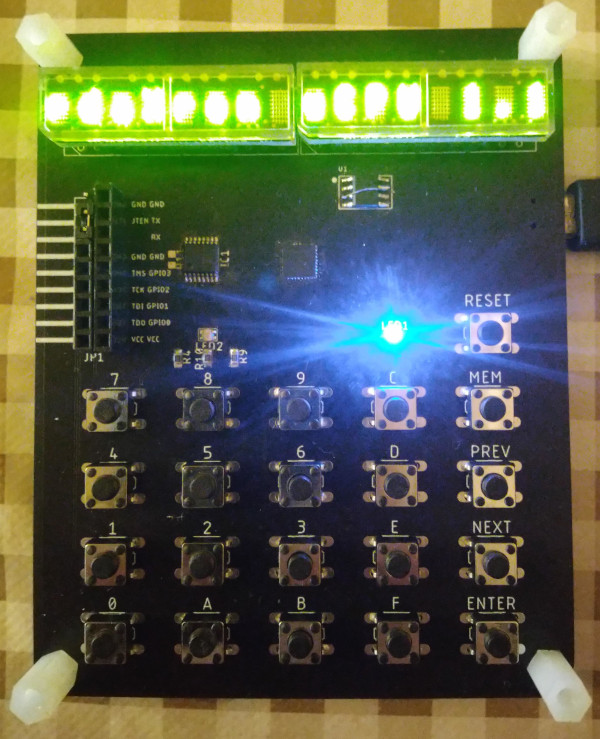

# Microcomputer with Lattice MachXO2-1200

* [Board](#board)
  * [UART](#uart)
  * [GPIO](#gpio)
  * [TIMER](#timer)
  * [Memory mapping](#memory-mapping)
* [Bootloader](#bootloader)
* [Examples](#examples)
  * [UART I/O](#uart-io)
  * [LED Matrix](#led-matrix)
  * [LED Display](#led-display)
  
[Back to main page](..)

## Board

The system uses a [microcomp board](https://github.com/pdaxrom/microcpu/tree/master/hw)

Implemented 15 bit I/O port, UART, TIMER, memory mapping and RESET signal. The default configuration includes 2KB of permanent RAM, pre-initialized with [bootloader](#bootloader) code and 2x2KB RAM mapper pages.

[Top](#microcomputer-with-lattice-machxo2-1200)

### UART

The UART has a fixed baud rate of 115200.

Address | Description
-|-
$FFE0|Status
$FFE1|Data

Status bit | Description
-|-
0|Byte received
1|Byte transmitting

[Top](#microcomputer-with-lattice-machxo2-1200)

### GPIO

I/O port uses 4 bits (maximum available pins for this board).

Address | Description
-|-
$FFE8|Keyboard row and SPI RAM
$FFE9|Display and output register
$FFEC|I/O bits 3..0
$FFED|Direction bits 3..0

Keyboard row and SPI RAM

7|6|5|4|3|2|1|0
-|-|-|-|-|-|-|-|
KR3|KR2|KR1|KR0|MCS|MSCK|MISO|MOSI

Display and output register

7|6|5|4|3|2|1|0
-|-|-|-|-|-|-|-|
0|0|REG_LATCH|BLANK|RS|CLK|CE|DIN

Direction bits 1 - output, 0 - input. By default, all bits are input.

[Top](#microcomputer-with-lattice-machxo2-1200)

### Timer

Address | Description
-|-
$FFF0|Initial value bits [7:0]
$FFF1|Initial value bits [15:8]
$FFF2|Status

Status bits: 1 - countdown finished, 0 - interrupt.
The interrupt bit is cleared after reading the status register.

[Top](#microcomputer-with-lattice-machxo2-1200)

### Memory mapping

The chip used has a limited RAM size, so there are three 2048 byte pages of memory. Page zero is permanent. The first page and the second can be located anywhere in the address space. An interrupt is triggered when accessing an empty address space. This can be used to implement virtual memory.

Address | Description
-|-
$FFF8|SRAM page 1
$FFF9|SRAM page 2
$FFFA|Memory violation page

The registers use bits 7: 3, which corresponds to bits 15:11 of the address space. The SRAM page registers also use bit 0 as flag for changed pages (write to the register to reset the flag).

[Top](#microcomputer-with-lattice-machxo2-1200)

## Bootloader

The UART bootloader allows you to load, save, and execute code.
By default, the loader scans memory pages for executables and runs them. At startup, the bootloader checks the data coming to the serial port, if the character code "z" is received, the response "Z" is sent and serial mode starts

Bootloader commands:

Command bytes | Size in bytes | Description
-|-|-
`'L' <start address> <end address>`|`5 + (payload)`|Loading code into RAM
`'S' <start address> <end address>`|`5 + (<end address> - <start address>)`|Saving code from memory
`'G' <start address>`|`3`|Execute code from start address

Data is transmitted to the bootloader in packets of 14 bytes, after which a sync byte is received.

The loader contains the following subroutines:

Address | Description
-|-
`$0000`|RESET
`$0008`|Get char from UART to register V0
`$000A`|Put char to UART from register V0
`$000C`|Put string to UART (V0 is pointer to null-terminated string)

[Top](#microcomputer-with-lattice-machxo2-1200)

## Examples

The examples are compiled by a microassembler and loaded by the bootloader via UART.

[Top](#microcomputer-with-lattice-machxo2-1200)

### UART I/O

Example of use UART [printuart.asm](../asm/examples/printuart.asm)

[Top](#microcomputer-with-lattice-machxo2-1200)

### Led Matrix

Example of use with led matrix (MAX7219) [matrix.asm](../asm/examples/matrix.asm)

[Top](#microcomputer-with-lattice-machxo2-1200)

### Led Display

Example of use with led matrix display [hcms.asm](../asm/examples/hcms.asm)

[Top](#microcomputer-with-lattice-machxo2-1200)
