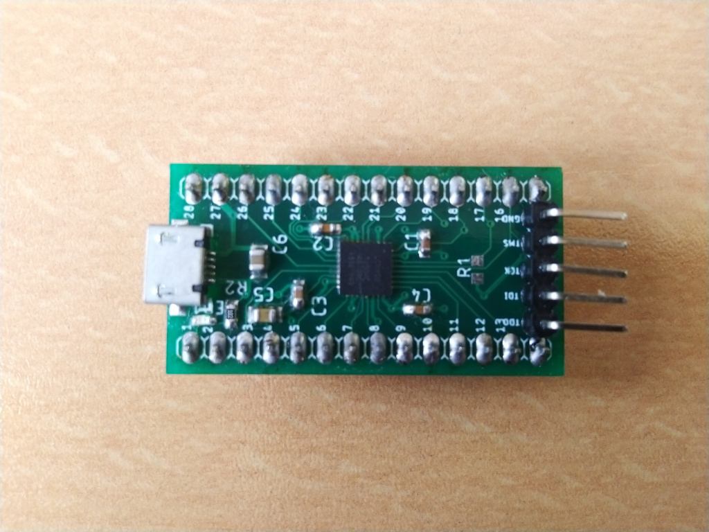
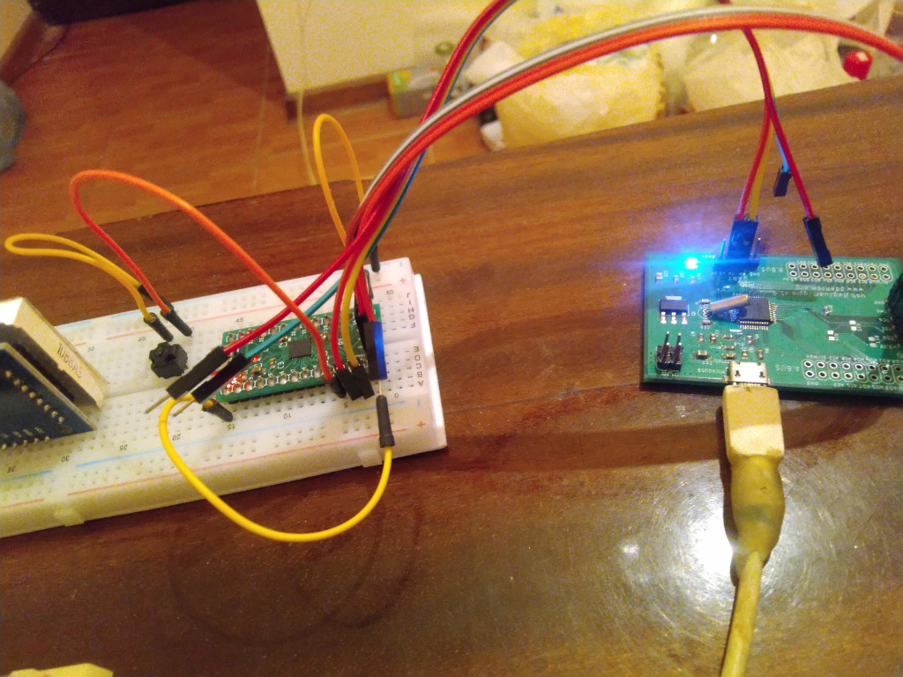
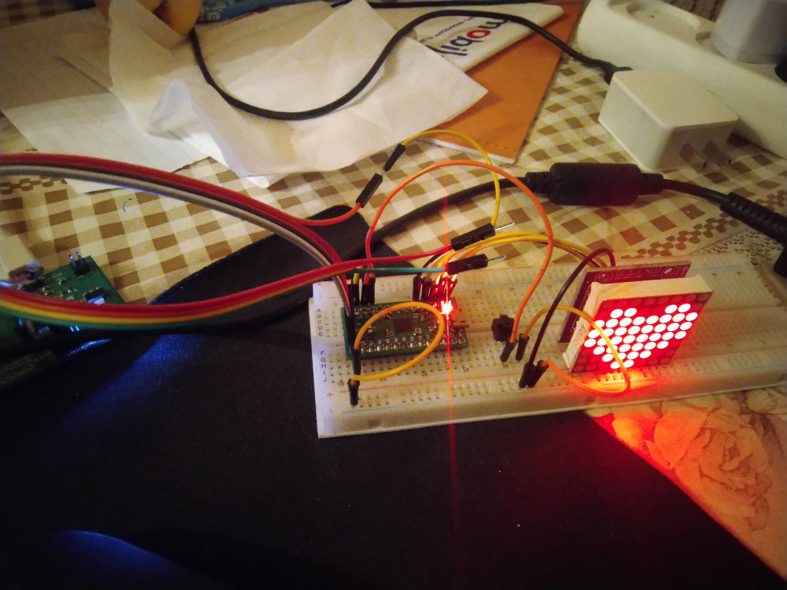
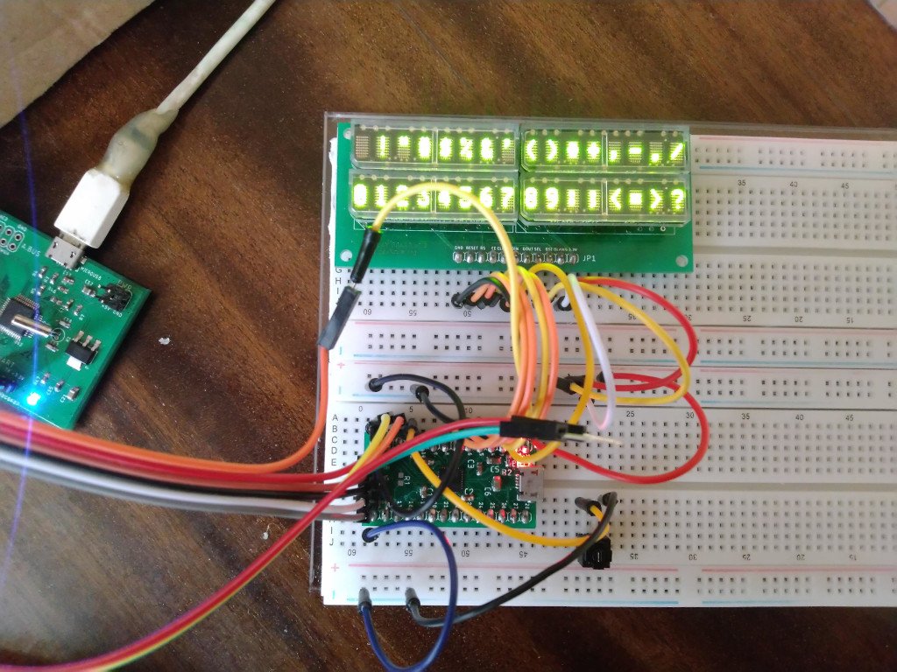

# Microcomputer with Lattice MachXO2-1200

The system uses a [microfpga board](https://github.com/pdaxrom/microfpga-demo)

Implemented 15 bit I/O port, UART and RESET signal.

Example of use UART [printuart.asm](../asm/examples/microcomp/printuart.asm)

Example of use with led matrix (MAX7219) [matrix.asm](../asm/examples/microcomp/matrix.asm)

Example of use with led matrix display [hcms.asm](../asm/examples/microcomp/hcms.asm)

