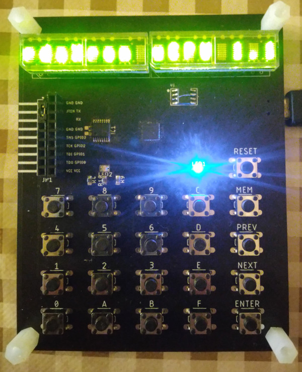
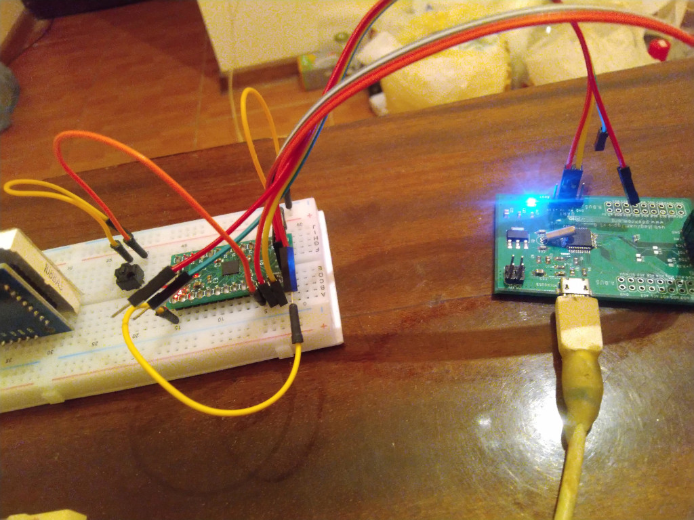
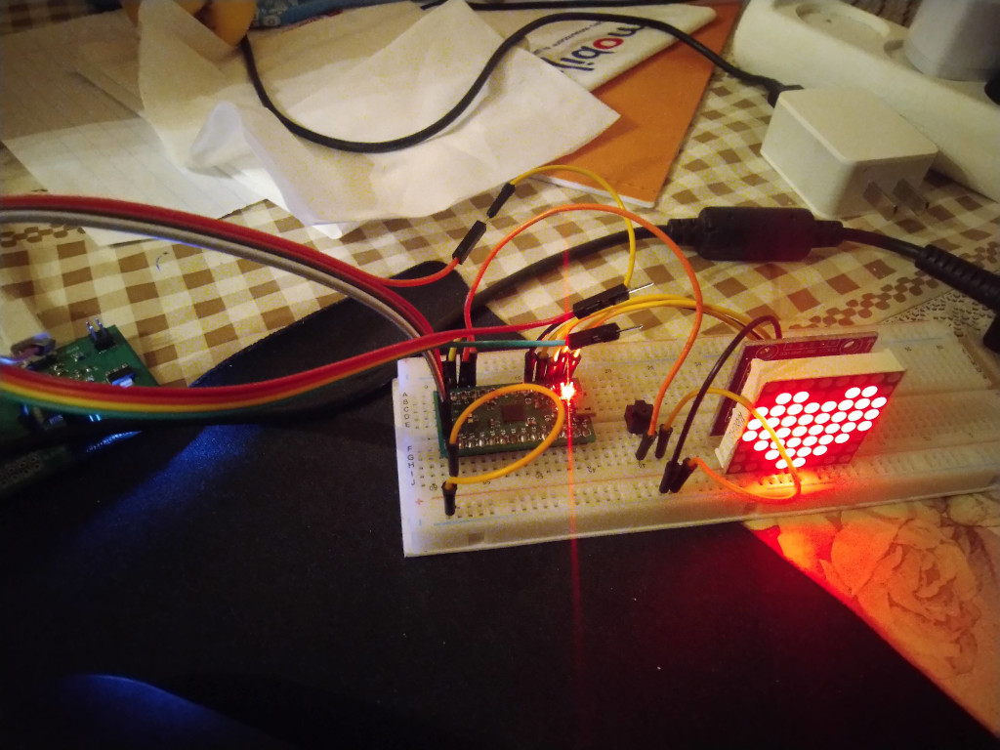
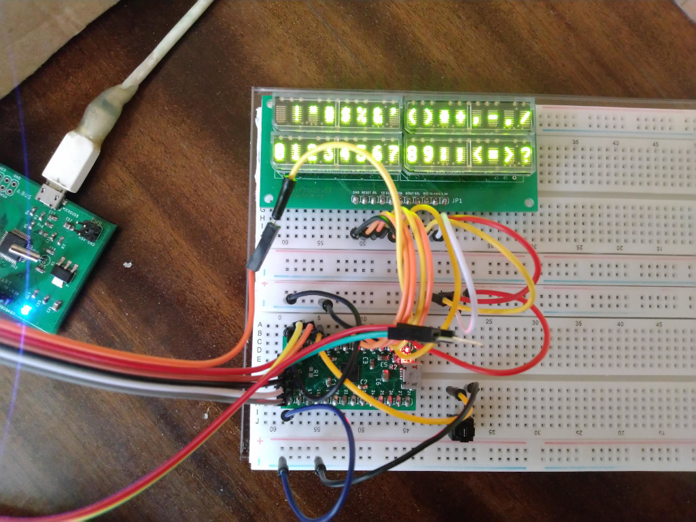

# Microcomputer with Lattice MachXO2-1200

* [J-11 / SD boot (default project)](#j-11--sd-boot-default-project)
* [Board](#board)
  * [UART](#uart)
  * [GPIO](#gpio)
  * [TIMER](#timer)
  * [Memory mapping](#memory-mapping)
* [Bootloader](#bootloader)
* [Examples](#examples)
  * [UART I/O](#uart-io)
  * [LED Matrix](#led-matrix)
  * [LED Display](#led-display)
  
[Back to main page](..)

## J-11 / SD boot (default project)

`boards/hc1200-microcomp/microcomp.ldf` now selects **J-11 without MMU,
EIS + FIS, a 50-Hz clock, and RK611-compatible SD boot**. Its top is
`ucode_sd_microcomp`, with the generated `sd_urom_ebr.v` and `sd.lpf`.
The original RISC hardware is preserved as `microcomp-original.ldf`;
`microcomp-j11.ldf` and the no-disk `microcomp-ucode.ldf` remain separate.

From the repository root, prepare the firmware before opening Diamond:

```sh
make -C boards/hc1200-microcomp
# Equivalent: make -C boards hc1200-microcomp
```

This builds `microasm` if necessary, assembles the SD-autoboot microcode and
generates `j11_sd.mem` / `sd_urom_ebr.v`. It works on the Mac without Diamond
or SCUBA. The repository-wide `make -C boards all` also includes these images,
but still generates the other/legacy boards' SCUBA RAMs and needs Diamond.
Generated files are not committed.

Open **`microcomp.ldf`** in Diamond and run through **JEDEC File**. To build
from the Ubuntu command line instead (build/export only, never program):

```sh
make -C boards/hc1200-microcomp diamond \
  DIAMOND_HOME=/home/sash/.local/lscc/diamond/3.14
```

The output is `impl1-sdboot/microcomp_impl1.jed`. This separate implementation
directory avoids reusing the old RISC results or its stale `impl1.xcf`.
Select this JED explicitly when later configuring Programmer. The script
exports only after TRACE reports zero cumulative negative slack. Commit
`6668a85` passed the full Diamond build through JED: 1095 LUT4, 548 slices,
7 EBRs, zero setup/hold errors at 26.6 MHz (TRACE maximum 37.627 MHz).
See [the build report, implemented pins and warnings](hc1200-sd-diamond.md).
External SD/FRAM timing and physical-board acceptance remain outstanding.

UART and SD locations come from the board's existing `microcomp.lpf`:

| Signal (FPGA perspective) | Site | Connection |
|---|---|---|
| `rx` | **PT15D** | UART adapter TX |
| `tx` | **PT17D** | UART adapter RX |
| `sd_cs_n` | PL9B | SD CS |
| `sd_mosi` | PR5C | SD MOSI |
| `sd_sck` | PT12D | SD clock |
| `sd_miso` | PT12C | SD MISO |

Console settings: **115200, 8N1, no flow control**, 3.3-V UART levels and a
common ground. RX and TX have not been swapped. The four former GPIO sites
are now assigned to SD, not simultaneously to two ports. Guest console
registers are the microcoded DL11 at octal `177560..177566`.

`sd.lpf` preserves the **entire original `microcomp.lpf`**, changing only
`gpio[0..3]` to `sd_cs_n`, `sd_mosi`, `sd_sck`, `sd_miso` in the IOBUF and
LOCATE entries. UART RX/TX, all four SD signals, FRAM and display signals
retain `PULLMODE=NONE`; reset retains `UP`, and keyboard rows retain `DOWN`.
All other locations, I/O types and SYSCONFIG settings are unchanged. The SD
top has no leftover generic `gpio[0..3]` ports. This preserves the board's
existing electrical configuration; simulation does not verify physical pulls.

After FPGA configuration or board reset, uROM reads sectors 0 and 1 from
SD into FRAM and enters guest address 0. FRAM needs no preinstalled bootstrap.
Use an **SDHC/SDXC card with a raw RK disk image at LBA 0**, not a file in FAT.
Guest `RESET` does not restart the boot. ODT remains deferred.
See [boot tests and limits](rt11-boot.md) for details and the verified RT-11 image.

Mac verification of the selected project, both UART pins and SD cold boot:

```sh
make -C testbench -f Makefile.disk hc1200-sd-test
```

The program is assembled by `microasm11`, loaded only into the simulated SD,
and checks a TX `'U'` / RX `'Z'` exchange through the actual board ports.
Project/ROM/pin consistency, exact LPF preservation (including pull modes),
top-level port coverage and build-script error gates are checked as well;
the latter uses mocked Diamond commands and is not a synthesis result.

For the old RISC project, run `make -C boards/hc1200-microcomp original`
(requires Diamond's SCUBA) and open `microcomp-original.ldf`. The addresses,
UART bootloader and examples in the remaining sections describe that
**original RISC configuration**, not the J-11 guest.

## Board

The system uses a [microcomp board](https://github.com/pdaxrom/microcpu/tree/master/hw)



Implemented 15 bit I/O port, UART, TIMER, memory mapping and RESET signal. The original RISC configuration includes 2KB of permanent RAM, pre-initialized with [bootloader](#bootloader) code and 2x2KB RAM mapper pages.

[Top](#microcomputer-with-lattice-machxo2-1200)

### UART

The UART has a fixed baud rate of 115200.

Address | Description
-|-
$FFE0|Status
$FFE1|Data

Status bit | Description
-|-
0|Byte received
1|Byte transmitting

[Top](#microcomputer-with-lattice-machxo2-1200)

### GPIO

I/O port uses 4 bits (maximum available pins for this board).

Address | Description
-|-
$FFE8|Keyboard row and SPI RAM
$FFE9|Display and output register
$FFEC|I/O bits 3..0
$FFED|Direction bits 3..0

Keyboard row and SPI RAM

7|6|5|4|3|2|1|0
-|-|-|-|-|-|-|-|
KR3|KR2|KR1|KR0|MCS|MSCK|MISO|MOSI

Display and output register

7|6|5|4|3|2|1|0
-|-|-|-|-|-|-|-|
0|0|REG_LATCH|BLANK|RS|CLK|CE|DIN

Direction bits 1 - output, 0 - input. By default, all bits are input.

[Top](#microcomputer-with-lattice-machxo2-1200)

### Timer

Address | Description
-|-
$FFF0|Initial value bits [7:0]
$FFF1|Initial value bits [15:8]
$FFF2|Status

Status bits: 1 - countdown finished, 0 - interrupt.
The interrupt bit is cleared after reading the status register.

[Top](#microcomputer-with-lattice-machxo2-1200)

### Memory mapping

The chip used has a limited RAM size, so there are three 2048 byte pages of memory. Page zero is permanent. The first page and the second can be located anywhere in the address space. An interrupt is triggered when accessing an empty address space. This can be used to implement virtual memory.

Address | Description
-|-
$FFF8|SRAM page 1
$FFF9|SRAM page 2
$FFFA|Memory violation page

The registers use bits 7: 3, which corresponds to bits 15:11 of the address space. The SRAM page registers also use bit 0 as flag for changed pages (write to the register to reset the flag).

[Top](#microcomputer-with-lattice-machxo2-1200)

## Bootloader

The UART bootloader allows you to load, save, and execute code.
By default, the loader scans memory pages for executables and runs them. At startup, the bootloader checks the data coming to the serial port, if the character code "z" is received, the response "Z" is sent and serial mode starts

Bootloader commands:

Command bytes | Size in bytes | Description
-|-|-
`'L' <start address> <end address>`|`5 + (payload)`|Loading code into RAM
`'S' <start address> <end address>`|`5 + (<end address> - <start address>)`|Saving code from memory
`'G' <start address>`|`3`|Execute code from start address

Data is transmitted to the bootloader in packets of 14 bytes, after which a sync byte is received.

The loader contains the following subroutines:

Address | Description
-|-
`$0000`|RESET
`$0008`|Get char from UART to register V0
`$000A`|Put char to UART from register V0
`$000C`|Put string to UART (V0 is pointer to null-terminated string)

[Top](#microcomputer-with-lattice-machxo2-1200)

## Examples

The examples are compiled by a microassembler and loaded by the bootloader via UART.

[Top](#microcomputer-with-lattice-machxo2-1200)

### UART I/O

Example of use UART [printuart.asm](../asm/examples/printuart.asm)



[Top](#microcomputer-with-lattice-machxo2-1200)

### Led Matrix

Example of use with led matrix (MAX7219) [matrix.asm](../asm/examples/matrix.asm)



[Top](#microcomputer-with-lattice-machxo2-1200)

### Led Display

Example of use with led matrix display [hcms.asm](../asm/examples/hcms.asm)



[Top](#microcomputer-with-lattice-machxo2-1200)
